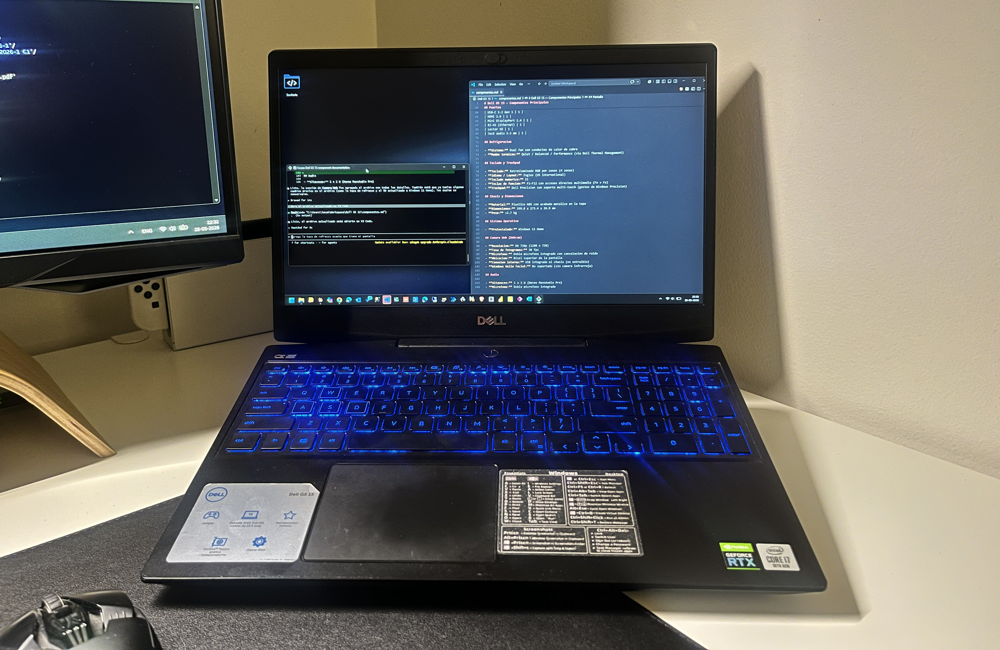

# Dell G5 15 — Documentación Técnica

Repositorio de referencia personal con la documentación técnica detallada de la notebook **Dell G5 15 5500**, incluyendo especificaciones de hardware, componentes instalados y configuración del sistema.

---

## Descripción

Este repositorio centraliza la información relevante del equipo con el objetivo de tener una referencia rápida y organizada ante actualizaciones de hardware, reinstalaciones del sistema operativo, diagnósticos o consultas técnicas.

## Contenido

| Archivo | Descripción |
|---|---|
| [componentes.md](componentes.md) | Especificaciones completas de todos los componentes del equipo |

## Especificaciones Principales

| Componente | Detalle |
|---|---|
| **CPU** | Intel Core i7-10750H — 6 núcleos / 12 hilos — Turbo 5.0 GHz |
| **GPU** | NVIDIA GeForce RTX 2060 6 GB GDDR6 + Intel UHD 630 |
| **RAM** | 32 GB DDR4 2933 MHz (Dual Channel) |
| **Almacenamiento** | 512 GB NVMe PCIe Gen 3 M.2 |
| **Pantalla** | 15.6" Full HD IPS Anti-glare — hasta 144 Hz |
| **SO** | Windows 11 Home |

---

> Documentación mantenida por el propietario del equipo.
